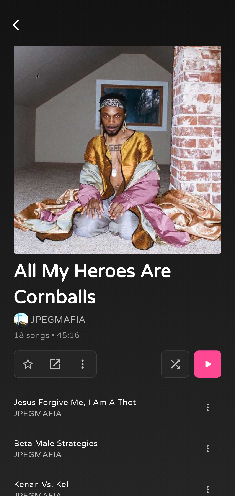
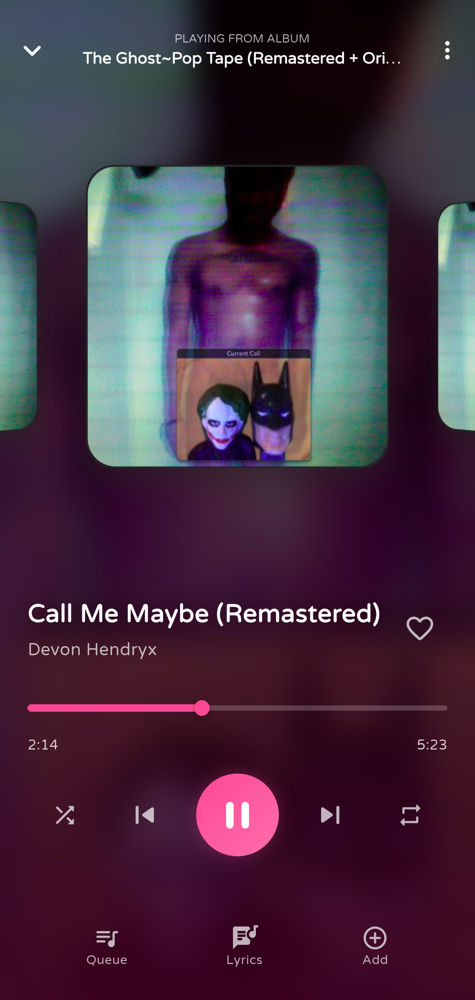

# Sono

<div align="center">
  

  **A beautiful local music player for Android**

  <a href="https://github.com/appsono/sono-mobile/releases/latest">
    
  </a>
  <a href="https://github.com/appsono/sono-mobile/releases">
    
  </a>
  <a href="https://github.com/appsono/sono-mobile/releases">
    
  </a>
  <br>
  <a href="https://flutter.dev">
    
  </a>
  <a href="https://www.gnu.org/licenses/gpl-3.0">
    
  </a>

  [Download](https://github.com/appsono/sono-mobile/releases) | [Branching Strategy](BRANCHING.md) | [Contributing](CONTRIBUTING.md)
</div>

---

## Screenshots

<div align="center">
  
  
  
  
</div>

---

## Features

### Music Library
- Browse your local music by **songs, albums, and artists**
- **Full-text search** across your entire library
- **Favorites** - mark songs, albums, and artists you love
- **Recently played** history
- **Excluded folders** - hide folders you don't want indexed

### Playlists
- Create and manage custom playlists
- Reorder songs with drag-and-drop
- Custom playlist covers (pick from gallery)
- MediaStore sync for system playlists

### Player
- **Fullscreen and mini player** views
- **Queue management** - view and edit the playback queue
- **Synced lyrics** display
- **Sleep timer** - fall asleep to your music
- **Crossfade** - smooth transitions between tracks
- **Playback speed & pitch** control
- **Equalizer** with presets
- Background playback with media controls

### Shared Audio Session (SAS)
- **Sync playback across devices** on the same network
- Connect via QR code scanning
- Real-time latency and connection quality monitoring
- Deep link support (`sonoapp://sas`)

### Metadata & Scrobbling
- **Last.fm integration** - scrobble your listening history
- Artist biographies and images from Last.fm
- Lyrics fetching
- Album artwork with blur effects

### Customization
- **Light, dark, and system themes**
- Multiple accent color options
- Rotating album art in now-playing view

### Account & Profile
- User registration and login
- Editable profile with display name, bio, and avatar

---

## Downloads

| Channel | Stability | Description |
|---------|-----------|-------------|
| **Stable** | Production | Thoroughly tested, recommended for most users |
| **Beta** | Testing | New features, may have minor bugs |
| **Nightly** | Development | Latest code, may be unstable |

Download from [Releases](https://github.com/appsono/sono-mobile/releases).

See [BRANCHING.md](BRANCHING.md) for details on our release strategy.

---

## Building from Source

### Prerequisites

- Flutter SDK 3.7+
- Android SDK (API level 21+)
- A Firebase project (for analytics/crash reporting)

### Setup

1. **Clone the repository**
   ```bash
   git clone https://github.com/appsono/sono-mobile.git
   cd sono-mobile
   ```

2. **Install dependencies**
   ```bash
   flutter pub get
   ```

3. **Configure environment**
   ```bash
   cp .env.template .env
   ```
   Edit `.env` with your API keys and configuration.

4. **Firebase setup**
   - Create a project at [Firebase Console](https://console.firebase.google.com)
   - Download `google-services.json` to `android/app/`
   - Or copy the template: `cp android/app/google-services.json.template android/app/google-services.json`

5. **Run the app**
   ```bash
   flutter run
   ```

### Release Build

```bash
# Create keystore (first time only)
keytool -genkey -v -keystore ~/sono-release.jks -keyalg RSA -keysize 2048 -validity 10000 -alias sonokey

# Configure signing
cp android/key.properties.template android/key.properties
# Edit android/key.properties with your keystore details

# Build APK
flutter build apk --release

# Or build App Bundle
flutter build appbundle --release
```

---

## Project Structure

```
lib/
├── main.dart                    # Entry point
├── app_scaffold.dart            # Main shell with bottom navigation
│
├── data/
│   ├── database/tables/         # SQLite table definitions
│   ├── migrations/              # Database migrations
│   ├── models/                  # Data models (playlist, favorites, etc.)
│   └── repositories/            # Data access layer
│
├── pages/
│   ├── main/                    # Home, Search, Library, Settings
│   ├── library/                 # Album, Artist, Playlist details
│   ├── auth/                    # Login, Registration
│   ├── info/                    # Changelog, Credits, Recents
│   └── setup/                   # Onboarding flow
│
├── services/
│   ├── api/                     # Backend API, Last.fm, MusicBrainz, Lyrics
│   ├── sas/                     # Shared Audio Session networking
│   ├── playlist/                # Playlist management
│   ├── artists/                 # Artist image fetching
│   ├── settings/                # Settings services
│   └── utils/                   # Theme, analytics, caching, updates
│
├── widgets/
│   ├── player/                  # Fullscreen player, mini player, queue, lyrics
│   ├── global/                  # Shared components (dialogs, headers, etc.)
│   ├── home/                    # Home page widgets
│   ├── library/                 # Library page widgets
│   └── sas/                     # SAS connection UI
│
├── styles/                      # Theme and text styles
└── utils/                       # Helpers and utilities
```

---

## Tech Stack

| Category | Technology |
|----------|------------|
| Framework | Flutter |
| Audio | just_audio, audio_service |
| Music Library | on_audio_query |
| State | Provider, RxDart |
| Database | SQLite (sqflite) |
| Networking | http, web_socket_channel |
| Analytics | Firebase Analytics & Crashlytics |

---

## Contributing

We welcome contributions! Please read [CONTRIBUTING.md](CONTRIBUTING.md) before submitting a PR.

**Always submit PRs to the `nightly` branch** unless it's a hotfix.

See [BRANCHING.md](BRANCHING.md) for our branching strategy.

---

## License

This project is licensed under the GNU General Public License v3.0 - see [LICENSE](LICENSE) for details.

---

## Links

- **Issues**: [GitHub Issues](https://github.com/appsono/sono-mobile/issues)
- **Website**: [sono.wtf](https://sono.wtf)
- **Contact**: business@mail.sono.wtf